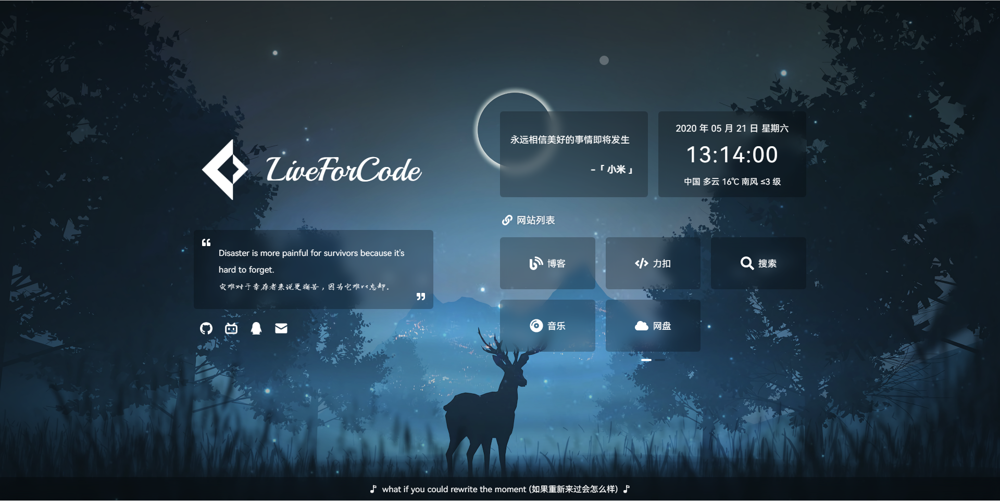

## WorstOne

基于 [**IMSYY**](https://github.com/imsyy) 的个人主页 `HOME` 修改而来。





### Demo

>由于 CDN 缓存原因，查看最新效果可能需要 <kbd>Ctrl</kbd> + <kbd>F5</kbd> 强制刷新浏览器缓存

- [WorstOne](https://www.worstone.cn)

### 功能

- [x] 载入动画
- [x] 站点简介
- [x] Hitokoto 一言
- [x] 日期及时间
- [x] 实时天气
- [x] 时光进度条
- [x] 音乐播放器
- [x] 移动端适配

**新增**

- [x] DailySentence 每日一句
- [x] 数据动态配置
- [x] 触摸滑动切换
- [x] 手动默哀模式
- [x] 适配各种屏幕尺寸

### 部署

* **安装** [node.js](https://nodejs.org/zh-cn/) **环境**

  > node > 16.16.0  
  > npm > 8.15.0
  
* 然后以 **管理员权限** 运行 `cmd` 终端，并 `cd` 到 项目根目录
* 在 `终端` 中输入：

```bash
# 安装 pnpm
npm install -g pnpm

# 安装依赖
pnpm install

# 预览
pnpm dev

# 构建
pnpm build
```
> 构建完成后，静态资源会在 **`dist` 目录** 中生成，可将 **`dist` 文件夹下的文件**上传至服务器，也可使用 `Vercel` 等托管平台一键导入并自动部署

### 配置项

<details>
<summary><h4>数据</h4></summary>

> 本项目数据相关配置，可使用接口获取相关数据
> <font color="red">*</font> 如果 **配置接口** 获取相关数据，需要接口配置 **跨域** 相关内容

请在 `.env` 环境变量中进行相关配置

```
# 歌曲
## 请在 public/data 目录下的 music.json 文件中配置
## 此处提供的服务可能会超量从而无法访问, 请自行部署
## 请参照 https://github.com/xizeyoupan/Meting-API 进行 API 服务部署
## 若使用 QQ音乐 歌单, 歌曲数量最好不要超出 50 首
## 备用: https://api.wuenci.com/meting/api/
## 参数说明: 
## api 歌曲 API 地址
## server 歌曲服务器 （ netease-网易云, tencent-QQ音乐 ）
## type 播放类型 （ song-歌曲, playlist-播放列表, album-专辑, search-搜索, artist-艺术家 ）
## id 播放目标 （ 歌曲ID 或 歌单ID 等 ）
VITE_MUSIC_URL = "/data/music.json"

# 社交链接
## 请在 public/data 目录下的 socialLinks.json 文件中配置
VITE_SOCIAL_URL = "/data/socialLinks.json"

# 网站列表
## 请在 public/data 目录下的 websiteLists.json 文件中配置
VITE_LISTS_URL = "/data/websiteLists.json"

# 背景图片
## 请在 public/data 目录下的 background.json 文件中配置
## 注: 请勿设置默认背景 url 属性, 请勿调整默认背景在配置文件中的位置
VITE_BACKGROUND_URL = "/data/background.json"

# 默哀模式
## 请在 public/data 目录下的 mourn.json 文件中配置
## 注: 不是默哀模式的开关, 而是手动开启默哀模式（非指定日期）
VITE_MOURN_URL = "/data/mourn.json"

# 更新日志
## 请在 public/data 目录下的 updateRecords.json 文件中配置
VITE_RECORDS_URL ="/data/updateRecords.json"

# 控制台内容
## 请在 public/data 目录下的 console.json 文件中配置
VITE_CONSOLE_URL = "/data/console.json"
```

</details>

<details>
<summary><h4>天气</h4></summary>

> <font color="red">*</font> 请将 ``VITE_WEATHER_KEY`` 替换为个人的 `Key`

天气及地区获取需要 `高德开放平台` 相关 API

- 前往 [高德开放平台控制台](https://console.amap.com/dev/index) 创建一个 `Web 服务` 类型的 `Key`，并将 `Key` 填入 `.env` 中的 `VITE_WEATHER_KEY` 中

也可自行更换其他方式

> 项目中使用的是 `高德开放平台` 中的 `Web API`，定位精度不高。如果想要**更高的定位精度**，则可以自行（需要修改代码）更换为 `JS API`

</details>

<details>
<summary><h4>音乐</h4></summary>

>本项目采用了基于 `MetingJS` 的 `Aplayer` 音乐播放器，可实现快速自定义歌单  
><font color="red">*</font> 仅支持 **中国大陆地区**

请在 `public/data/` 目录下的 `music.json` 文件中更改歌曲相关参数即可实现自定义歌单列表

```json
{
    "api": "https://api.i-meto.com/meting/api/", 
    "server": "netease",
    "type": "playlist",
    "id": "2243342814"
}
```
> <font color="red">*</font> **音乐播放器** 相关配置可以在网站 **全局设置** 页面进行修改

</details>

<details>
<summary><h4>每日一句</h4></summary>

> **每日一句** 数据来源自 **金山词霸**，开启 **每日一句**会替换 **站点简介**
> <font color="red">*</font> **每日一句** 相关配置可以在网站 **全局设置** 页面进行修改

</details>

<details>
<summary><h4>社交链接</h4></summary>

请在 `public/data/` 目录下的 `socialLinks.json` 文件中配置

```json
[
    {
        "name": "Github",
        "icon": "/image/icon/github.png",
        "tip": "去 Github 看看 !",
        "url": "https://github.com/first19326"
    }, {
        "name": "BiliBili",
        "icon": "/image/icon/bilibili.png",
        "tip": "( °  - °)つロ 干杯 ~",
        "url": "https://space.bilibili.com/"
    }, {
        "name": "QQ",
        "icon": "/image/icon/qq.png",
        "tip": "有什么事吗 ?",
        "url": "https://res.abeim.cn/api/qq/?qq=1400134416"
    }, {
        "name": "Email",
        "icon": "/image/icon/email.png",
        "tip": "来封 Email ~",
        "url": "mailto:1400134416@qq.com"
    }
]
```

> <font color="red">*</font> 请勿配置过多，否则需要自行适配样式（最多可以配置 **7** 个社交链接）
</details>

<details>
<summary><h4>一言数据</h4></summary>

> **Hikotoko 一言** 相关数据通过对应接口获得，此处配置为接口失效显示的 **默认数据**

请在 `.env` 环境变量中进行相关配置

```
# 一言数据（默认）
VITE_HITOKOTO_TEXT = "简单地活着，肆意而又精彩。"
VITE_HITOKOTO_FROM = "WorstOne"
```

</details>

<details>
<summary><h4>网站列表</h4></summary>

请在 `public/data/` 目录下的 `websiteLists.json` 文件中配置

```json
[
    {
        "icon": "Link",
        "title": "网站列表",
        "items": [
            [
                {
                    "icon": "Blog",
                    "name": "博客",
                    "url": "https://notes.worstone.cn/"
                }, {
                    "icon": "Code",
                    "name": "力扣",
                    "url": "https://leetcode.cn/"
                }, {
                    "icon": "Search",
                    "name": "搜索",
                    "url": "https://kaifa.baidu.com/"
                }, {
                    "icon": "CompactDisc",
                    "name": "音乐",
                    "url": "https://music.163.com/"
                }, {
                    "icon": "Cloud",
                    "name": "网盘",
                    "url": "https://www.aliyundrive.com/"
                }
            ], [
                    {
                    "icon": "Train",
                    "name": "开往",
                    "url": "https://www.foreverblog.cn/go.html"
                }, {
                    "icon": "Book",
                    "name": "背单词",
                    "url": "https://kaiyiwing.gitee.io/qwerty-learner/"
                }
            ]
        ]
    }, {
        "icon": "Bars",
        "title": "功能列表",
        "items": [
            [
                {
                    "icon": "PencilAlt",
                    "name": "一言",
                    "method": "hitokoto"
                }, {
                    "icon": "SlidersH",
                    "name": "播放器",
                    "method": "player"
                }, {
                    "icon": "Music",
                    "name": "音乐列表",
                    "method": "music"
                }, {
                    "icon": "Cog",
                    "name": "全局设置",
                    "method": "setting"
                }
            ]
        ]
    }
]
```

> **网站列表** 支持列表切换，可分别配置 **网站列表**、**功能列表** 以及 **友情链接** 等。每个列表已引入触摸滑动插件 `Swiper`，支持分页操作，每页项目不可超过 **6** 个（**超出部分不显示**）

修改网站链接图标，需要修改 `src/components/Lists/index.vue`

- 引入图标组件
- 在 `collection` 中对图标组件进行映射

```vue
<script setup>
import { Blog, Code, Search, CompactDisc, Cloud, Train, Book, Link } from "@vicons/fa";
    
// 名称与组件集合
const icons = {
    "Blog": Blog,
    "Book": Book,
    "Cloud": Cloud,
    "Code": Code,
    "CompactDisc": CompactDisc,
    "Search": Search,
    "Train": Train
};
</script>
```

> 若**图标组件不存在**或通过图标名称**找不到对应组件**，则会默认使用 `Link` 图标

修改关联方法，需要修改 `src/components/Lists/index.vue`

- 创建相关方法
- 在 `methods` 中对方法进行映射

```vue
<script setup>
const hitokoto = () => {
    store.musicOpenState = false;
};

const musicPlayer = () => {
	store.musicOpenState = true;
};

const musicList = () => {
	store.musicListShow = true;
};

const setting = () => {
	store.setOpenState = true;
};

// 方法名称与方法集合
const methods = {
    "hitokoto": hitokoto,
    "music": musicList,
    "player": musicPlayer,
    "setting": setting
};
</script>
```
</details>

<details>
<summary><h4>背景图片</h4></summary>

请在 `public/data/` 目录下的 `background.json` 文件中配置

> 若 `url` 参数为空，则会 **随机** 从 `images` 里面选取图片
> <font color="red">*</font> 请勿设置 **默认背景** `url` 属性，请勿调整 **默认背景** 在配置文件中的位置

```json
[
    {
        "name": "默认背景",
        "url": "",
        "images": [
            "/image/background/home.jpg", "/image/background/home.jpeg", 
            "/image/background/back.jpg", "/image/background/back.jpeg"
        ]
    }, {
        "name": "每日一图",
        "url": "https://api.dujin.org/bing/1920.php",
        "images": []
    }, {
        "name": "随机风景",
        "url": "https://api.btstu.cn/sjbz/api.php?lx=fengjing&format=images",
        "images": []
    }
]
```

> <font color="red">*</font> 部分浏览器不支持 `webp` 格式的图片，为了保证网站效果尽量不要使用该格式图片

</details>

<details>
<summary><h4>默哀模式</h4></summary>

> <font color="red">*</font> 这个配置不是默哀模式的开关，而是手动开启默哀模式（非指定日期）

请在 `public/data/` 目录下的 `mourn.json` 文件中配置

```json
{
    "mournSwitch": false,
    "mournText": ""
}
```
</details>

<details>
<summary><h4>更新日志</h4></summary>

请在 `public/data/` 目录下的 `updateRecords.json` 文件中配置

```json
{
    "fix": [
        "音乐播放器存在的问题",
        "网站列表中链接点击范围不正确的问题"
    ],
    "new": [
        "静音功能",
        "网站图标配置",
        "键盘控制事件",
        "Swiper 相关配置",
        "音乐播放器的相关设置",
        "vue-aplayer.min.js 文件",
        "动态获取更新日志的数据方式",
        "当前音乐在音乐列表中置顶显示的效果"
    ],
    "delete": [
        "Safari 浏览器中的默认点击样式"
    ],
    "update": [
        "版权信息逻辑",
        "网站加载逻辑",
        "更新日志样式",
        "更新日志内容种类",
        "更新日志数据内容",
        "音乐控制面板样式",
        "音乐播放器切换音乐方法",
        "时光胶囊以及设置页面样式",
        "初始化音乐播放器的代码结构",
        "打开音乐播放器按钮的显示动画"
    ]
}
```
</details>

<details>
<summary><h4>控制台输出</h4></summary>

请在 `public/data/` 目录下的 `console.json` 文件中配置

控制台输出有 **3** 种模式：`random`，`banner` 以及默认

- `random`：随机颜色在控制台输出，输出内容直接配置在数组中即可
- `banner`：类似 `badge` 标识在控制台输出，输出内容必须以**长度为 2 的数组形式**配置在数组中（参见 `console.json` 配置信息）
- 默认：固定颜色在控制台输出

```json
[
    ["WorstOne's website LiveForCode", "简单地活着, 肆意而又精彩!"], 
    ["Based on IMSYY's website Home.", "Author IMSYY"]
]
```
</details>

### Q & A

1. 加载速度的问题

   在本地通过 `pnpm dev` 运行网站的时候，第一次加载会很慢，这是由于 **Vite** 项目的特性，并且本地运行的时候网络协议为 **HTTP/1.1**。如果想要改善网站加载速度慢的问题，可以考虑使用 **CDN** 对站点进行加速，可以参考 [静态网站部署](https://notes.worstone.cn/article/479644713/)。


2. 音乐播放器的问题

   音乐播放器使用的是 `vue3-aplayer` 插件，只是在 `vue-aplayer` 插件基础上对 **Vue3** 进行适配，并未解决插件自身的问题。

   新增的 **vue-aplayer.min.js** 文件是插件问题修复后打包的文件，替换插件中的对应文件即可解决音乐播放器相关问题。

   > 如果修改未生效，使用 `pnpm dev --force` 预览
   >
   > <font color="red">*</font> 此方法对 Vercel 部署的网站无效，后续会思考其他解决方案

3. 音乐自动播放的问题

   由于浏览器权限的问题，音乐自动播放会失效，需要在浏览器中添加相关设置解决（以 Edge 浏览器为例）。

   **设置** -> **Cookie 和网站权限** -> **媒体自动播放**，然后 **添加网站地址** 即可。

### 技术栈

* [Vue](https://cn.vuejs.org/)
* [Vite](https://vitejs.cn/vite3-cn/)
* [Pinia](https://pinia.vuejs.org/zh/)
* [xicons](https://xicons.org/)
* [Swiper](https://www.swiper.com.cn/)
* [Aplayer](https://aplayer.js.org/)
* [IconPark](https://iconpark.oceanengine.com/official)

### API

* [Meting API](https://api.i-meto.com/meting/api/)
* [每日一句 API](https://m.iciba.com/daily/)
* [高德开放平台](https://lbs.amap.com/)
* [Hitokoto 一言](https://hitokoto.cn/)

### 更新日志

- 2023-11-14

  `U` 修改了音乐播放器歌词样式

  
  
- 2023-11-11

  `F` 修复了音乐播放器静音的问题

  <br/>
  
  `A` 新增了 `font-display` 属性
  
  `U` 修改了音乐播放器静音问题的解决方式
  
  
  
- 2023-11-10

  `U` 修改了音乐播放器提示文本，并调整了代码结构

  `U` 修改了 logo 区域样式

  
  
- 2023-11-05

  `F` 修复了 Safari 浏览器由于动画重复，在关闭 `音乐列表` 时 **屏幕闪烁** 的问题

  `F` 修复了移动端模式下，在 `背景图片展示` 状态，移动端 `菜单按钮` 仍旧显示的问题

  `F` 修复了 720px 宽度时，移动端 `菜单按钮` 不显示的问题

  `F` 修复了 `背景图片展示` 状态，`下载图片` 按钮无法点击的问题

  `F` 修复了 Safari 浏览器 `消息提示` 内容超出容器的问题

  `F` 修复了由 PC 端模式 调整到 移动端模式 后，音乐列表关闭的问题

  <br/>

  `A` 新增了 `加载动画` 组件

  `A` 新增了字体文件

  `A` 新增了部分 `全局变量`

  `A` 新增了部分 `环境变量`

  `A` 新增了自动导入 Vue 相关组件的配置

  `A` 新增了音乐加载失败的方法

  `A` 新增了 `网站列表` 切换功能

  `D` 删除了无用的样式文件

  `U` 修改了网站结构以及样式

  `U` 修改了字体样式文件

  `U` 修改了模块数据结构

  `U` 修改了 `环境变量` 引入方式

  `U` 修改了部分插件版本

  `U` 修改了部分代码，统一编码结构

  `U` 修改了 `背景图片` 加载逻辑

  
  
- 2023-07-06

  `A` 新增了关于 `更新日志` 的注释

  `U` 修改了 `更新日志` 内容种类

  `U` 修改了 `更新日志` 数据内容

  

- 2023-07-03

  `F` 修复了 `网站列表` 中链接点击范围不正确的问题

  `F` 修复了音乐播放器存在的问题，修复方式参见 **Q & A**

  <br/>

  `A` 新增了网站图标配置

  `A` 新增了 **vue-aplayer.min.js** 文件

  `A` 新增了音乐播放器的相关设置

  `A` 新增了当前音乐在音乐列表中置顶显示的效果

  `A` 新增了动态获取 `更新日志` 的数据方式

  `A` 新增了静音功能，可以通过点击 `音量图标` 开启

  `A` 新增了 `Swiper` 相关配置，以适配移动端操作

  `A` 新增了键盘控制事件，可以通过 <kbd>Ctrl</kbd> + <kbd>←</kbd> / <kbd>→</kbd> 切换音乐

  `A` 新增了相关样式，去除了 Safari 浏览器中的默认点击样式

  `U` 修改了音乐控制面板样式
  
  `U` 修改了初始化音乐播放器的代码结构
  
  `U` 修改了音乐播放器切换音乐方法
  
  `U` 修改了版权信息逻辑
  
  `U` 修改了 `打开音乐播放器` 按钮的显示动画
  
  `U` 修改了 `更新日志` 的样式，去掉标题粗体
  
  `U` 修改了 `时光胶囊` 以及 `设置` 页面样式，以适配更大屏幕设备
  
  `U` 修改了网站加载逻辑，调整了 `欢迎提示` 以及 `默哀模式` 执行时间点
  
  
  
- 2023-05-12

  `F` 修复了 Safari 浏览器默认背景图片无法显示的问题

  `F` 修复了 Safari 浏览器 `backdrop-filter` 属性不生效的问题

  `F` 修复了默认背景图片无法下载的问题

  `F` 修复了 `网站列表` 中链接点击范围不准确的问题

  `F` 修复了 `720px - 910px` 屏幕尺寸无法打开音乐播放器的问题

  <br/>

  `A` 新增了 `DailySentence` 每日一句

  `A` 新增了触摸滑动切换

  `A` 新增了多种工具方法

  `U` 修改了移动端逻辑，引入触摸滑动插件 `Swiper`

  `U` 修改了网站名称字体，并适配各种屏幕尺寸

  `U` 修改了网站样式，添加最小的宽度以及高度，保证显示效果

  
  
- 2023-05-28

  `F` 修复了 Safari 浏览器歌词过长导致样式显示不正确的问题

  `F` 修复了 手机端 Safari 浏览器 `时间卡片` 以及 `一言卡片`  的 `Pagination` 不显示的问题

  <br/>

  `A` 新增了 `256 x 256` 尺寸的图标

  `A` 新增了 `公安备案` 的配置选项以及相关样式

  `U` 修改了 `时间卡片` 以及 `一言卡片` 的位置

  `U` 修改了 `网站列表` 渲染逻辑

  `U` 修改了 `apple-touch-icon` 图标

  `U` 修改了页面底部样式
  
  `U` 修改了 **腾讯云** `Serverless` 配置选项，解决了推送修改 `ACL 权限` 的问题

